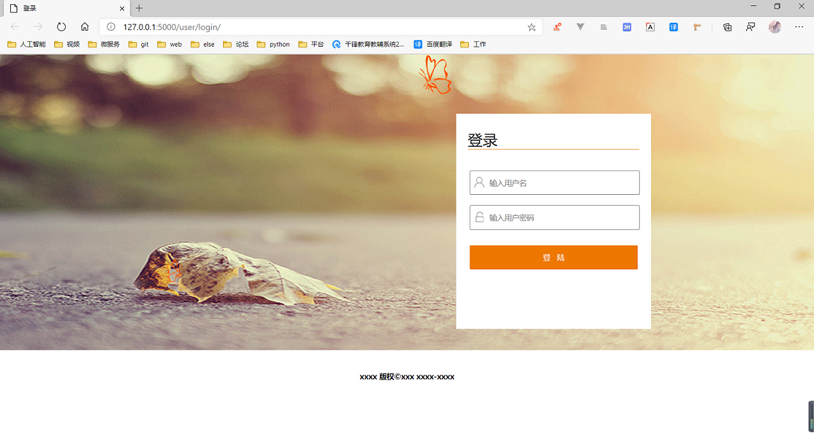
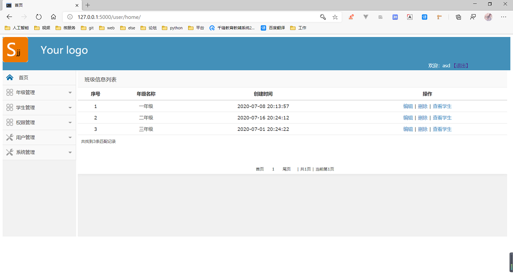
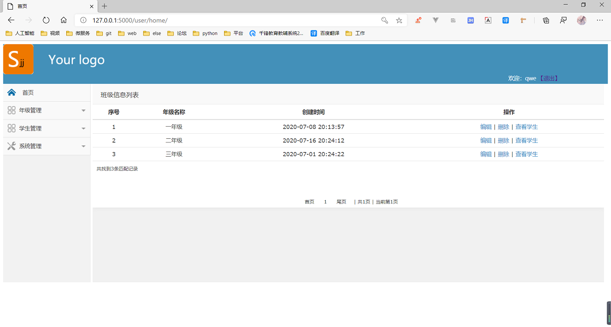

# 基于flask的学生管理系统
> 练习一下flask，模仿并熟悉一下基本flask基本编程，实现crud的学生权限管理系统，redis存储session

镜像地址： `-i https://mirror.baidu.com/pypi/simple`  
创建数据库： `create database practicelibrary default charset utf8;`  

操作数据库
```
/db/create_db/  根据model创建数据库
/db/drop_db/    删除数据库
```

到登录页面：`http://127.0.0.1:5000/`
#### 登录

#### 超级管理员界面

#### 教师界面


```shell
pip freeze > requirements.txt
pip install -r requirements.txt
```
